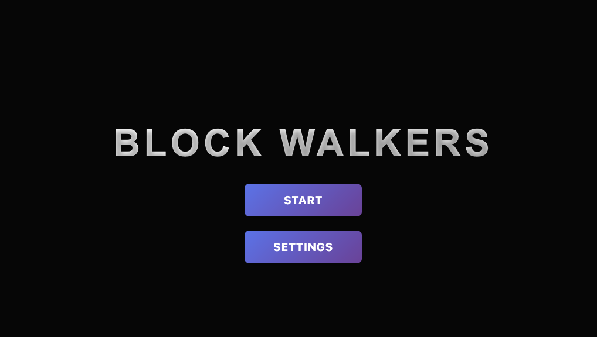
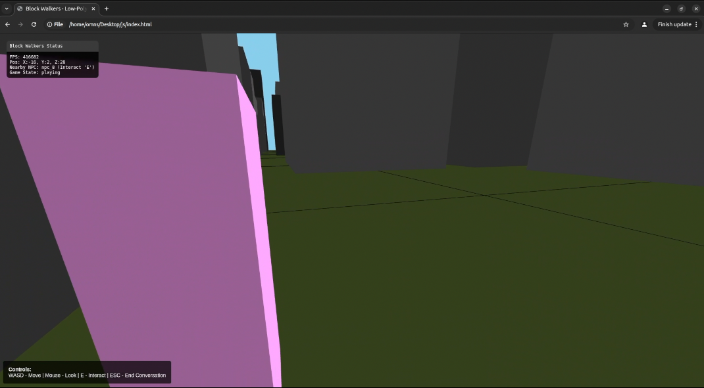

# Block Walkers: An Agentic AI Coding Sandbox




**Block Walkers** is a simple, self-contained 3D web game designed to be a standardized test bed for evaluating the "agentic coding" capabilities of different AI models. The project is intentionally kept simple, making it the perfect "quilt" or sandbox for giving an AI a task—like adding a new feature or fixing a bug—and observing its performance.

This project was initially bootstrapped by the **Kimi K2** model, but the resulting code was non-functional. The project was then debugged, refactored, and completed using **Gemini**.

## Core Technologies

-   **Rendering:** [three.js](https://threejs.org/) (r128)
-   **AI/LLM:** [Transformers.js](https://github.com/xenova/transformers.js)
-   **Default Model:** `Xenova/Qwen1.5-0.5B-Chat`
-   **Language:** JavaScript (ES Modules)

## Features

-   Procedural City: A low-poly city block is generated on startup.
-   First-Person Controls: Standard `WASD` for movement and `Mouse` for looking.
-   Wandering NPCs: NPCs roam the city with basic movement logic.
-   Real-Time AI Chat: Interact with any NPC by getting close and pressing `E`. Conversations are powered by a language model running entirely in your browser via WebGPU.
-   Customizable AI Personality: An in-game settings panel allows you to edit the three system prompts that are randomly chosen to give NPCs their personality.
-   UI Overlays: A draggable mini-panel displays real-time game status.

## How to Run

This project must be run from a local web server to avoid browser security (CORS) issues when loading the AI model.

1.  **Clone the Repository:**
    ```bash
    git clone [https://github.com/your-username/block-walkers.git](https://github.com/your-username/block-walkers.git)
    cd block-walkers
    ```
2.  **Download `three.min.js`:**
    This project uses `three.js` r128. Download the file from the link below and place it in the root of your project folder.
    -   [Download three.min.js (r128)](https://cdnjs.cloudflare.com/ajax/libs/three.js/r128/three.min.js)

3.  **Start a Local Server:**
    The easiest way is using the **Live Server** extension in Visual Studio Code.
    -   Install the "Live Server" extension.
    -   Open the project folder in VS Code.
    -   Click the "Go Live" button in the bottom-right corner of the window.

The game will open in your browser. The initial loading of the AI model may take a minute, and you will see a progress bar for the download.

## Using as an Agentic Coding Sandbox

The primary purpose of this repository is to provide a consistent environment for testing AI agents. You can give an AI a task and provide it with the contents of the relevant script(s) to see how it performs.

#### **Example Task for an AI:**

> **Your task:** Add a "sprint" ability to the player. When the user holds the `Shift` key while moving, the player's movement speed should be doubled. You will need to modify the `player.js` and `utils.js` files.

By observing how different models approach this task—whether they correctly identify where to modify the code, handle the logic correctly, and produce functional output—you can compare their agentic capabilities.

## File Structure

-   `index.html`: The main entry point for the game, contains all HTML structure and UI panels.
-   `game.js`: The central controller; manages the game state, renderer, and main loop.
-   `chat.js`: Handles the `transformers.js` pipeline, AI model loading, and chat logic.
-   `player.js`: Manages player movement, camera controls, and input.
-   `npc.js`: Defines the NPC behavior, including creation and movement.
-   `city.js`: Contains the logic for procedurally generating the city buildings and ground.
-   `utils.js`: A helper file containing shared constants (like speeds and distances) and utility functions.
-   `mini-panel.js`: The logic for the draggable UI overlay that shows game status.

## License

This project is licensed under the Apache 2.0 License. See the `LICENSE` file for details.
